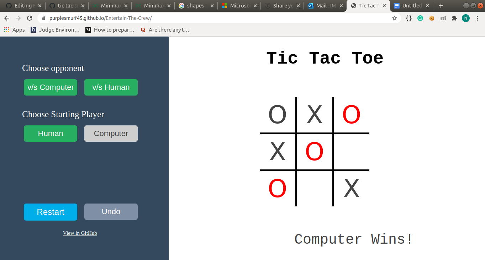

## THE MARS COLONIZATION PROGRAM

# Unbeatable Tic-Tac-Toe
<p>

An implementation of Minimax AI Algorithm on Tic-Tac-Toe (or Noughts and Crosses) game. Link: [Unbeatable-Tic-tac-toe - Minimax](https://purplesmurf45.github.io/Entertain-The-Crew/)


## Minimax Algorithm:
Minimax is a artificial intelligence backtracking algoritmn which is generally used in game theory and decision making to find the most optimal move for a player. Such games are known as zero-sum games, wherein a player can either win (+1), lose (-1) or draw (0) with his opponent.

## Working of the Algorithm
There are two players namely: the maximizer and the minimizer. Here the maximizer tries to get a higher score while the minimizer works towards the opposite, i.e. getting the lowest possible score. The algorithm's aim is to get to the configuration(board state) where the maximizer does not lose (win or draw). In a given state, if the the score is positive implies that the maximizer has the upper hand while a negetive score implies that the minimizer is leading. The algorithm recursively searches through all possible outcomes and then backtracks and makes a decision. This process continues until the algorithm finds a terminal state, i.e. win, draw or lose.


## Pseudo code

```
function findBestMove(board):
    bestMove = NULL
    for each move in board :
        if current move is better than bestMove
            bestMove = current move
    return bestMove

function minimax(board, depth, isMaximizingPlayer):

    if current board state is a terminal state :
        return value of the board
    
    if isMaximizingPlayer :
        bestVal = -INFINITY 
        for each move in board :
            value = minimax(board, depth+1, false)
            bestVal = max( bestVal, value) 
        return bestVal

    else :
        bestVal = +INFINITY 
        for each move in board :
            value = minimax(board, depth+1, true)
            bestVal = min( bestVal, value) 
        return bestVal
        
        /*Pseudo code from geeksforgeeks.*/
        
```
##  My Code
It has two modes, human v/s human and human v/s computer. By default, it is on the former mode, but it can easily switch to the other one, just click on the 'v/s Computer' button. In the human v/s computer mode, we can select to take the first turn. In, human v/s human mode, the turns have to be taken consequetively by the 2 players. Both the modes include an undo button.

<p align="center">
	</img>
</p>


References:
* https://www.geeksforgeeks.org/minimax-algorithm-in-game-theory-set-1-introduction/
* https://www.geeksforgeeks.org/minimax-algorithm-in-game-theory-set-3-tic-tac-toe-ai-finding-optimal-move/
* https://github.com/Cledersonbc/tic-tac-toe-minimax

